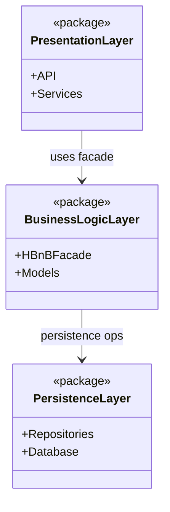
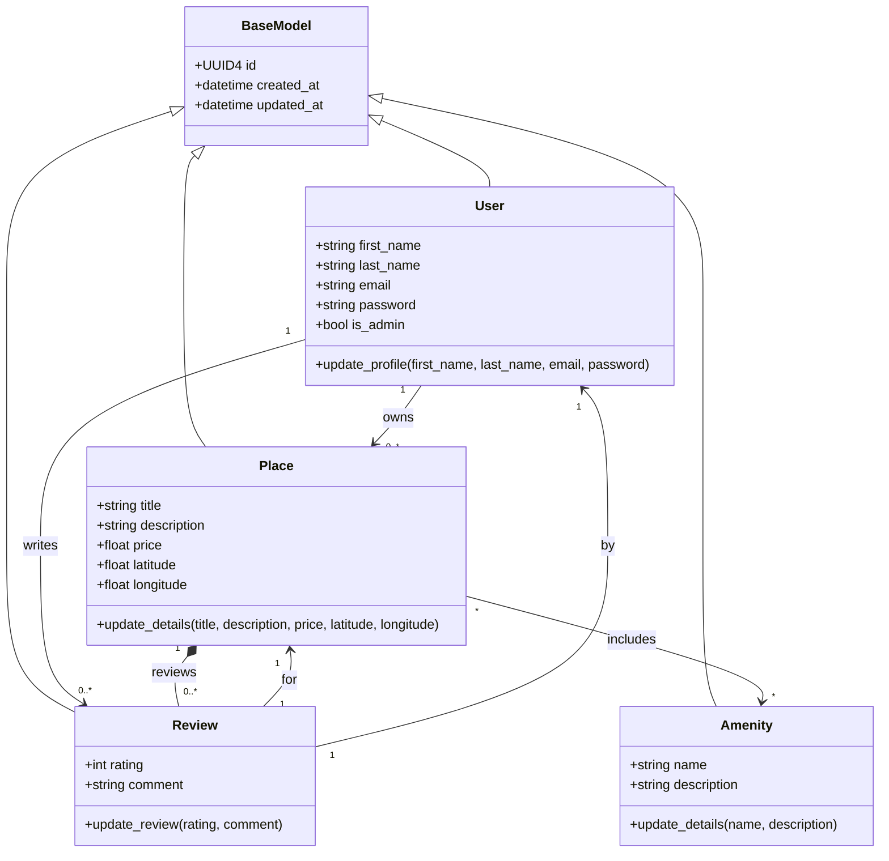
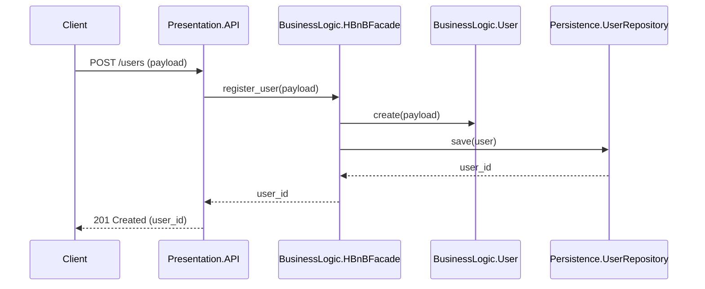
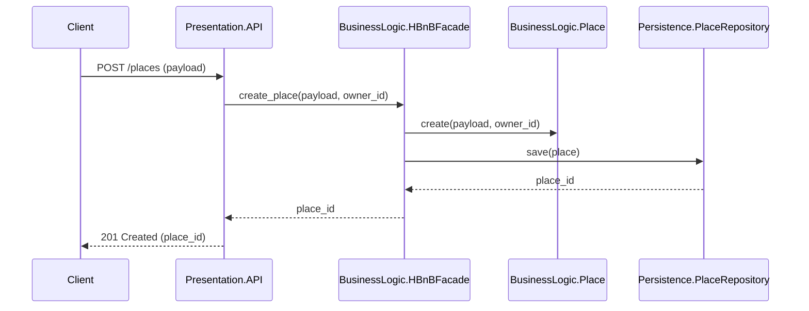
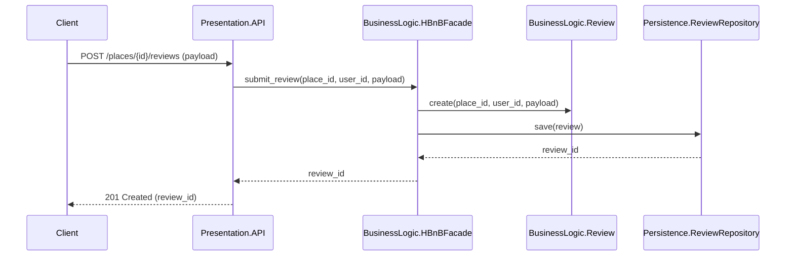
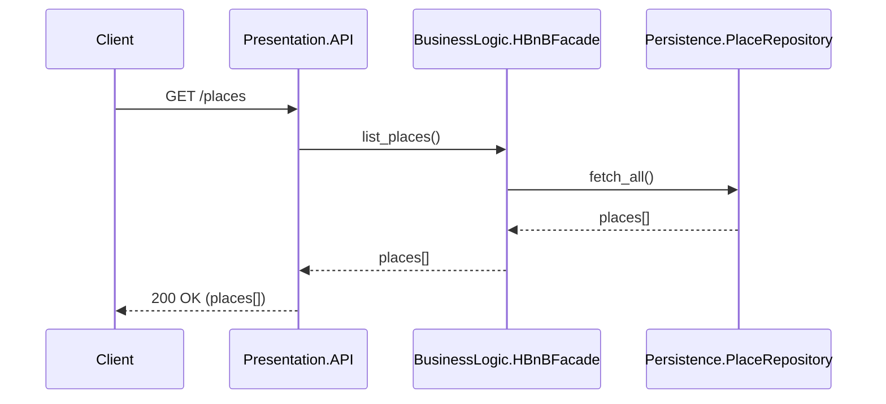

# HBnB Evolution - Part 1 (UML Technical Documentation)

## 1. Introduction

This document compiles the UML diagrams and explanatory notes for the HBnB Evolution application. It provides a clear reference for the system architecture, business logic, and API interaction flows that will guide the implementation phases.

## 2. High-Level Architecture (Package Diagram)

Diagram source: `part1/diagrams/package-diagram.mmd`.

**Explanatory Notes**
- **Purpose:** Show the three-layer architecture and the facade as the access point to business logic.
- **Presentation Layer:** Exposes API endpoints/services for users to interact with the system.
- **Business Logic Layer:** Encapsulates domain rules and models; `HBnBFacade` offers a unified interface.
- **Persistence Layer:** Handles data storage and retrieval through repositories/DAOs.

## 3. Business Logic Layer (Class Diagram)

Diagram source: `part1/diagrams/business-logic-class.mmd`.

**Explanatory Notes**
- **Purpose:** Define core entities, attributes, methods, and relationships within the business logic layer.
- **BaseModel:** Shared identity and audit fields (`id`, `created_at`, `updated_at`) for all entities.
- **User:** Manages account/profile data; can own places and write reviews.
- **Place:** A property listing owned by a user; aggregates amenities and reviews.
- **Review:** User feedback for a specific place, with rating and comment.
- **Amenity:** A reusable feature (e.g., Wi-Fi, pool) associated with places.
- **Inheritance:** All entities generalize from `BaseModel` to standardize UUID4 and timestamps.
- **Composition:** `Place` composes `Review` records (reviews exist in the context of a place).
- **Associations:** Users own places and write reviews; places include amenities (many-to-many).

## 4. API Interaction Flow (Sequence Diagrams)

### 4.1 User Registration

Diagram source: `part1/diagrams/sequence-user-registration.mmd`.

### 4.2 Place Creation

Diagram source: `part1/diagrams/sequence-place-creation.mmd`.

### 4.3 Review Submission

Diagram source: `part1/diagrams/sequence-review-submission.mmd`.

### 4.4 Fetch List of Places

Diagram source: `part1/diagrams/sequence-list-places.mmd`.

**Explanatory Notes (Sequence Diagrams)**
- **User Registration:** API receives signup payload, facade validates/creates user, persistence saves, API returns new `user_id`.
- **Place Creation:** API submits place data and owner id, facade builds place, persistence stores, API returns `place_id`.
- **Review Submission:** API forwards review data with place/user context, facade creates review, persistence saves, API returns `review_id`.
- **List Places:** API requests place list, facade queries repository, persistence returns collection, API responds with `places[]`.

## 5. Overall Notes

- **Entities:** `User`, `Place`, `Review`, and `Amenity` are uniquely identified by UUID4 and track `created_at`/`updated_at` through `BaseModel`.
- **Layer Interaction:** All external requests flow through the Presentation layer to the Facade, which coordinates domain rules and persistence.

## 6. Manual QA Review Checklist

- Confirm all diagrams use UML notation and render correctly in Mermaid.
- Verify package diagram shows all three layers and the facade interaction path.
- Verify class diagram includes attributes, methods, relationships, and cardinalities.
- Verify each sequence diagram matches the requested API flow.
- Confirm entity rules (UUID4, created_at/updated_at) are reflected in the class diagram.

## 7. Diagram Exports

Rendered PNG and PDF exports are available in `part1/diagrams/exports/`.
